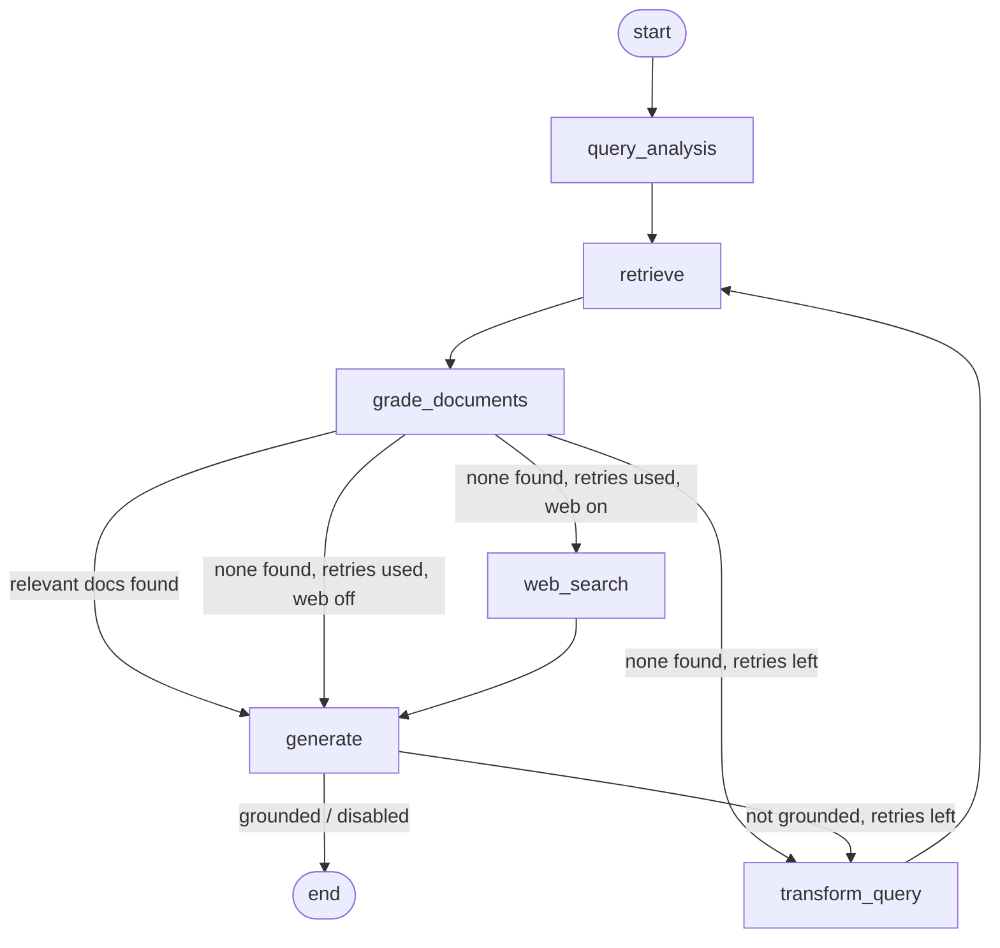

# RAG-Based Technical Documentation Assistant

A **self-corrective Retrieval-Augmented Generation (RAG)** system that answers questions
about a corpus of technical documentation. It is built as a **LangGraph `StateGraph`** with
distinct nodes for query analysis, retrieval, document grading, and answer generation, and
is served through a **FastAPI** application. The LLM runs on **Groq**; embeddings run
locally via **sentence-transformers**, so the only credential you need is a free Groq key.

The pipeline is *self-corrective*: it grades every retrieved chunk for relevance and, when
retrieval is poor, rewrites the query and tries again (bounded by a retry limit) before
falling back to an honest "I don't know." Optional Self-RAG-style checks (hallucination
verification) and a web-search fallback are included.

---

## Table of Contents

1. [Architecture](#architecture)
2. [The LangGraph Workflow](#the-langgraph-workflow)
3. [State Schema](#state-schema)
4. [Chunking & Embedding Strategy](#chunking--embedding-strategy)
5. [Setup (Step by Step)](#setup-step-by-step)
6. [Running the Application](#running-the-application)
7. [API Reference & Examples](#api-reference--examples)
8. [Streamlit UI (Bonus)](#streamlit-ui-bonus)
9. [Bonus Features](#bonus-features)
10. [Project Structure](#project-structure)
11. [Testing](#testing)
12. [Design Decisions & Tradeoffs](#design-decisions--tradeoffs)
13. [Assumptions](#assumptions)
14. [What I'd Improve With More Time](#what-id-improve-with-more-time)

---

## Architecture



The system has two phases:

- **Ingestion (offline):** load documents → chunk → embed → store in ChromaDB.
- **Query (online):** run the LangGraph workflow above to produce a grounded, cited answer.

**Component choices**

| Concern        | Choice                                        | Why |
|----------------|-----------------------------------------------|-----|
| Orchestration  | LangGraph `StateGraph`                        | Explicit nodes/edges make branching and the self-correction loop visible and testable. |
| LLM            | Groq (`openai/gpt-oss-120b` by default)       | Very fast inference, generous free tier. |
| Embeddings     | `sentence-transformers/all-MiniLM-L6-v2`      | Runs locally, no API key, 384-dim, fast and accurate enough for docs. |
| Vector store   | ChromaDB (persistent)                         | Local, zero-config, persists to disk — ideal for prototyping. |
| API            | FastAPI                                       | Type-safe, auto-generated OpenAPI docs, async file uploads. |

---

## The LangGraph Workflow

Each node is a small function in [`app/graph/nodes.py`](app/graph/nodes.py); routing lives
in [`app/graph/edges.py`](app/graph/edges.py); assembly is in
[`app/graph/workflow.py`](app/graph/workflow.py).

**Node 1 — `query_analysis`.** Rewrites/expands the raw question into a keyword-rich
retrieval query and classifies it (`conceptual` / `how-to` / `troubleshooting` /
`api-reference`). If a `session_id` is supplied, prior turns are included so follow-up
questions resolve correctly.

**Node 2 — `retrieve`.** Runs a top-*k* similarity search over ChromaDB and returns the
chunks with their source metadata.

**Node 3 — `grade_documents`.** The self-corrective core. An LLM grades **each** chunk as
relevant or irrelevant and filters out the noise. (Web-search results are trusted and not
re-graded.)

**Node 4 — `generate`.** Produces the final answer grounded **only** in the surviving
chunks, with inline `[n]` citations that map to the returned `sources`. If no chunks
survive, it returns an explicit "I don't know" instead of hallucinating. When enabled, a
groundedness check runs here.

**Fallback nodes**

- `transform_query` — rewrites the query and increments the retry counter.
- `web_search` — (optional) augments context with Tavily results when the corpus fails.

**Conditional edges (routing logic)**

- *After grading* (`decide_after_grading`):
  relevant docs → `generate`; none but retries remain → `transform_query` → `retrieve`
  (loop); none and retries exhausted → `web_search` (if enabled) else `generate`
  ("I don't know").
- *After generation* (`decide_after_generation`, Self-RAG):
  grounded/disabled → `END`; not grounded and retries remain → `transform_query` to fetch
  better context and regenerate.

---

## State Schema

The state schema was treated as a first-class design task (see
[`app/graph/state.py`](app/graph/state.py)). Every field documents exactly what flows
between nodes:

| Field             | Type              | Role |
|-------------------|-------------------|------|
| `question`        | `str`             | Original question, **never mutated** — answers and citations always track true intent. |
| `history`         | `str`             | Rendered prior turns (conversation memory). |
| `query`           | `str`             | The **mutable** query actually used for retrieval; rewritten on retries. |
| `query_type`      | `str`             | Classification from Node 1. |
| `documents`       | `List[Document]`  | Chunks kept after grading — the working context. |
| `retries`         | `int`             | Rewrite→re-retrieve attempts so far. |
| `max_retries`     | `int`             | Upper bound that terminates the loop. |
| `web_search_used` | `bool`            | Whether the web fallback contributed context. |
| `generation`      | `str`             | Final answer. |
| `grounded`        | `Optional[bool]`  | Hallucination-check result (`None` if disabled). |

**How retries are tracked:** `question` (fixed) and `query` (mutable) are deliberately
separated. `transform_query` rewrites `query` and increments `retries`; the routing
function compares `retries` against `max_retries` to decide whether to keep looping. This
guarantees termination — a query that never finds relevant docs stops after
`max_retries` and returns "I don't know" rather than cycling forever.

---

## Chunking & Embedding Strategy

**Chunking (two-stage, structure-aware) — see [`app/ingestion.py`](app/ingestion.py):**

1. **Header split.** For Markdown, `MarkdownHeaderTextSplitter` splits on `#`/`##`/`###`
   and records the heading path as `section` metadata. This keeps each chunk inside one
   logical section and preserves the context it belongs to (returned in citations).
2. **Size split.** `RecursiveCharacterTextSplitter` then enforces `CHUNK_SIZE` (default
   **1000**) with `CHUNK_OVERLAP` (default **150**, ~15%), splitting on paragraph →
   sentence → word boundaries so cuts fall in natural places.

*Why:* technical docs are hierarchical. A naive fixed-size split can sever a code block or
strip a paragraph from its heading; header-aware splitting avoids that and yields more
precise retrieval with self-describing chunks. Non-Markdown text uses the recursive
splitter directly. The overlap ensures a sentence spanning a boundary still appears intact
in at least one chunk.

**Embeddings:** `all-MiniLM-L6-v2` (384-dim sentence-transformer). It is small, fast, runs
fully locally (no API key, no per-token cost), and is well-suited to short technical
passages. Cosine similarity is used for retrieval. Swap it via `EMBEDDING_MODEL` if you
prefer a hosted or larger model.

---

## Setup (Step by Step)

**Prerequisites:** Python **3.10+** and a free Groq API key
(<https://console.groq.com/keys>).

```bash
# 1. Clone and enter the project
git clone <your-repo-url>
cd rag-doc-assistant

# 2. Create and activate a virtual environment
python -m venv .venv
source .venv/bin/activate          # Windows: .venv\Scripts\activate

# 3. Install dependencies
pip install -r requirements.txt

# 4. Configure environment
cp .env.example .env
#    then edit .env and set GROQ_API_KEY=...
```

> **First run note:** the embedding model (~80 MB) downloads automatically the first time
> ingestion runs, then is cached locally. No embedding API key is required.

---

## Running the Application

```bash
# Start the API (auto-ingests the bundled corpus on first startup)
uvicorn app.main:app --reload
```

- Interactive API docs (Swagger UI): <http://localhost:8000/docs>
- ReDoc: <http://localhost:8000/redoc>

The bundled corpus (four Markdown references on FastAPI, Pydantic, LangGraph, and RAG) is
indexed automatically the first time the server starts if the store is empty. To (re)build
the index manually without starting the server:

```bash
python -m scripts.ingest_corpus                 # ingest the bundled corpus
python -m scripts.ingest_corpus --dir ./my_docs # ingest a custom folder
python -m scripts.ingest_corpus --url https://example.com/guide.md
```

To build a corpus from live URLs instead of the bundled files:

```bash
python -m scripts.fetch_corpus     # downloads sample docs into data/corpus
python -m scripts.ingest_corpus
```

---

## API Reference & Examples

| Method | Endpoint     | Purpose                                  |
|--------|--------------|------------------------------------------|
| POST   | `/query`     | Ask a question; returns answer + sources |
| POST   | `/ingest`    | Ingest documents (file uploads and/or URLs) |
| GET    | `/documents` | List indexed sources and chunk counts   |
| POST   | `/feedback`  | Submit thumbs up/down on an answer       |
| GET    | `/health`    | Liveness probe                           |
| GET    | `/`          | Service metadata & effective config      |

### `POST /query`

```bash
curl -s http://localhost:8000/query \
  -H "Content-Type: application/json" \
  -d '{"question": "How does FastAPI handle request bodies?"}'
```

```json
{
  "answer": "FastAPI reads the request body as JSON and validates it against a Pydantic model you declare as a parameter [1]. Invalid bodies produce a 422 response describing which field failed [1].",
  "sources": [
    {
      "id": 1,
      "source": "fastapi_guide.md",
      "section": "FastAPI Reference Guide > Request Body",
      "snippet": "To receive a JSON request body, declare a Pydantic model as a parameter...",
      "origin": "corpus"
    }
  ],
  "query_type": "how-to",
  "rewritten_query": "FastAPI request body parsing and validation with Pydantic models",
  "retries": 0,
  "grounded": true,
  "web_search_used": false,
  "session_id": null
}
```

Optional fields: `session_id` (enables follow-up questions) and `top_k` (override
retrieval breadth).

### `POST /ingest`

Send as `multipart/form-data` with file parts, URL form fields, or both:

```bash
# Upload files
curl -s -X POST http://localhost:8000/ingest \
  -F "files=@./notes.md" -F "files=@./api.txt"

# Ingest URLs
curl -s -X POST http://localhost:8000/ingest \
  -F "urls=https://raw.githubusercontent.com/pydantic/pydantic/main/README.md"
```

```json
{
  "ingested_sources": ["notes.md", "api.txt"],
  "documents_added": 2,
  "chunks_added": 11,
  "message": "Indexed 11 chunk(s) from 2 document(s)."
}
```

### `GET /documents`

```bash
curl -s http://localhost:8000/documents
```

```json
{
  "documents": [
    {"source": "fastapi_guide.md", "chunk_count": 11},
    {"source": "langgraph_guide.md", "chunk_count": 9},
    {"source": "pydantic_guide.md", "chunk_count": 10},
    {"source": "rag_and_vector_search.md", "chunk_count": 9}
  ],
  "total_sources": 4,
  "total_chunks": 39
}
```

### `POST /feedback`

```bash
curl -s -X POST http://localhost:8000/feedback \
  -H "Content-Type: application/json" \
  -d '{"question": "How do I define a Pydantic model?",
       "answer": "Inherit from BaseModel...",
       "rating": "up",
       "comment": "Clear and correct."}'
```

```json
{ "status": "recorded", "feedback_id": "7c1f...e2" }
```

Feedback is appended to `data/feedback.jsonl` (one JSON object per line).

**Error handling.** Requests are validated by Pydantic (`422` on malformed input). `/ingest`
returns `400` when no file or URL is supplied. `/query` returns `503` with a clear message
if `GROQ_API_KEY` is missing.

---

## Streamlit UI (Bonus)

A minimal chat UI is provided in [`streamlit_app.py`](streamlit_app.py):

```bash
uvicorn app.main:app --reload      # terminal 1 (API)
streamlit run streamlit_app.py     # terminal 2 (UI)
```

It shows answers with expandable sources, per-answer metadata (query type, retries,
groundedness, web-search usage), a live view of indexed documents, and URL ingestion. It
maintains a `session_id` so follow-up questions work.

---

## Bonus Features

All four optional features from the brief are implemented:

- **Hallucination check (Self-RAG):** `check_grounded` verifies the answer is entailed by
  the retrieved context; if not (and retries remain), the graph re-retrieves and
  regenerates. Toggle with `ENABLE_HALLUCINATION_CHECK`. The result is returned as
  `grounded` on every response.
- **Web-search fallback:** when the corpus yields nothing after retries, the graph can call
  Tavily and generate from web results. Enable with `ENABLE_WEB_SEARCH=true` **and** a
  `TAVILY_API_KEY`. Off by default so the project runs with only a Groq key.
- **Conversation memory:** pass a `session_id` to `/query`; the last few turns are fed into
  query analysis so follow-ups resolve. See [`app/memory.py`](app/memory.py).
- **Simple UI:** the Streamlit app above.

---

## Project Structure

```
rag-doc-assistant/
├── app/
│   ├── main.py            # FastAPI app + endpoints + startup seeding
│   ├── config.py          # Settings from env / .env (pydantic-settings)
│   ├── models.py          # Request/response schemas
│   ├── llm.py             # Groq client, prompts, structured graders (lazy)
│   ├── vectorstore.py     # Chroma + embeddings wrapper (lazy, injectable)
│   ├── ingestion.py       # Load → chunk (header-aware) → index
│   ├── memory.py          # Per-session conversation history
│   ├── feedback.py        # Feedback → JSONL
│   └── graph/
│       ├── state.py       # GraphState schema
│       ├── nodes.py       # query_analysis / retrieve / grade / generate / fallbacks
│       ├── edges.py       # Conditional routing functions
│       └── workflow.py    # StateGraph assembly + compile
├── scripts/
│   ├── ingest_corpus.py   # Standalone ingestion CLI
│   └── fetch_corpus.py    # Optional: fetch real docs from URLs
├── data/corpus/           # Bundled corpus (4 Markdown docs)
├── tests/test_smoke.py    # Offline end-to-end tests (fake LLM + in-memory store)
├── streamlit_app.py       # Bonus UI
├── requirements.txt
├── .env.example
└── README.md
```

---

## Testing

`tests/test_smoke.py` exercises the real ingestion, chunking, graph wiring, and API
layers while substituting the vector store (in-memory + deterministic fake embeddings) and
the LLM (Python stubs). This verifies control flow — including the self-correction retry
loop — **offline, with no API key and no model download**.

```bash
python -m tests.test_smoke     # plain runner
# or, if pytest is installed:
pytest -q
```

Covered: markdown-aware chunking + section metadata; the happy path
(retrieve → grade → generate); the retry loop terminating at `max_retries` with an honest
"I don't know"; and all API endpoints including validation errors.

---

## Design Decisions & Tradeoffs

- **LangGraph over a hand-rolled pipeline.** The self-corrective loop (grade → maybe
  rewrite → re-retrieve) is naturally a cyclic graph. Modeling it as a `StateGraph` keeps
  control flow explicit and each node independently unit-testable, at the cost of a little
  boilerplate versus a linear script.
- **Local embeddings, hosted LLM.** Groq handles the reasoning-heavy calls fast; embeddings
  stay local to avoid a second API dependency and per-token cost. Tradeoff: the first run
  downloads the model, and a small local model is slightly less accurate than a large
  hosted one — acceptable for prototyping and swappable via config.
- **Grade every chunk individually.** More LLM calls (one per chunk) but a cleaner, more
  reliable relevance signal than grading the whole batch at once, and it maps directly to
  the brief's "grade each retrieved chunk."
- **Fail open on grader/parse errors.** If a grading or groundedness call fails, the code
  keeps the chunk / accepts the answer rather than dropping context, favouring a useful
  answer over a silent empty result. Structured-output calls all have fallbacks so a single
  malformed model response never crashes a request.
- **Separate `question` vs `query` in state.** Enables query rewriting for retrieval while
  keeping citations and generation anchored to the user's real intent, and makes retry
  tracking unambiguous.
- **`openai/gpt-oss-120b` as the default model.** Groq deprecated the Llama chat models in
  mid-2026, so defaulting to a current production model means the project runs on first try;
  it stays configurable via `GROQ_MODEL`.
- **ChromaDB over FAISS.** Chroma persists to disk and handles metadata out of the box with
  near-zero setup; FAISS is faster at scale but is a library, not a store, so metadata is
  more manual. For this corpus size, simplicity wins.

---

## Assumptions

- The corpus is small (a handful of documents) and trusted, so ingestion does not sandbox
  or sanitize document content beyond text extraction.
- A single-process deployment is fine for the assignment; conversation memory and the Groq
  client are therefore in-process (not shared across workers).
- Groq function-calling / structured output is available for the chosen model. If a chosen
  model lacks it, the structured helpers fall back gracefully (raw question, keep-chunk,
  accept-answer) rather than failing.
- Requests are single-user and not authenticated; auth/rate-limiting are out of scope.

---

## What I'd Improve With More Time

- **Reranking** (e.g. a cross-encoder) between retrieval and grading to improve top-*k*
  precision before spending LLM calls on grading.
- **Streaming responses** (`/query` via SSE) and streaming the graph's intermediate steps
  to the UI for live progress.
- **Persistent, shared memory** (Redis) and a real database for feedback so state survives
  restarts and scales across workers.
- **Evaluation harness** using the collected feedback plus a labelled question set
  (retrieval hit-rate, groundedness, answer quality) to tune chunk size, `top_k`, and
  prompts empirically.
- **Batched / async grading** to cut latency, and a token-based splitter matched to the
  embedding model's tokenizer.
- **Incremental ingestion** with content hashing to deduplicate and update chunks instead
  of re-adding them.
```
run code
uvicorn app.main:app 

streamlit run streamlit_app.py 